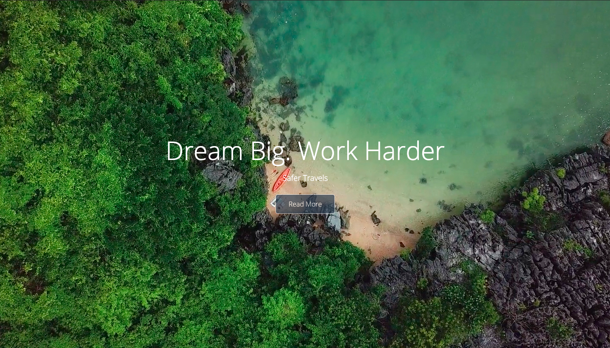
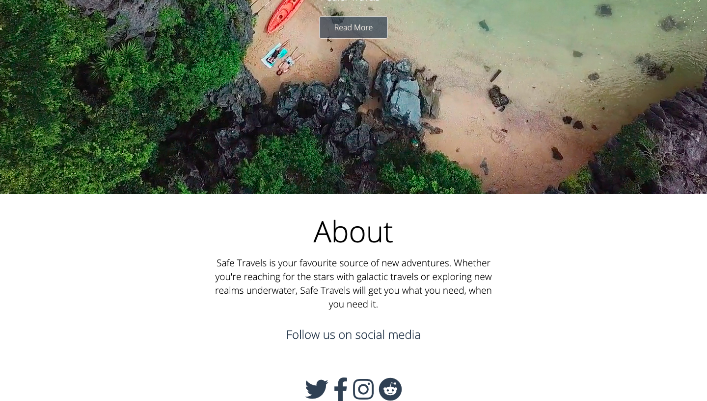
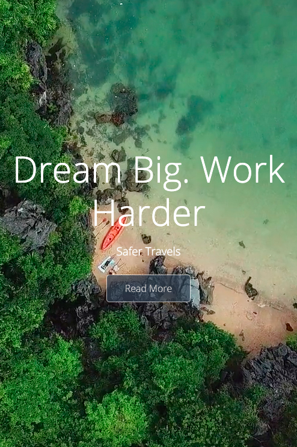

# video-background

A responsive homepage with a video background for a travel website. 

 
  
## Screenshot

## Built With  
  
- HTML
- CSS
- Font Awesome
- Google Fonts
- Pexels

  
## Live Project and Presentation

 
[Live App](https://calvinoea-video-background.glitch.me/)

## Getting Started  
You may use the following steps to get a local copy:
  
Clone project to your local machine  
cd to the project directory  
Open project in IDE/Text Editor  
Open Live Preview through IDE or use localhost to view the project in your browser  
  
## 🤝 Contributing
You are welcome to make contributions to the repository. Contributions may be made through issues comments and feature requests.

